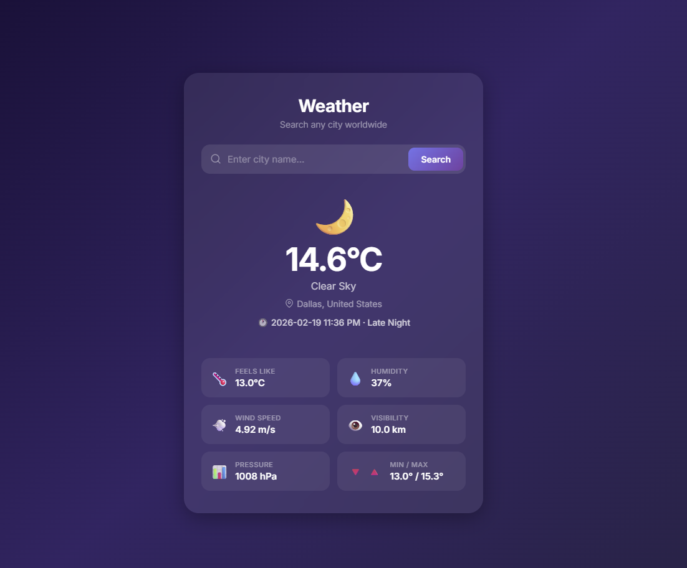

# 🌦️ Weather App

A sleek and modern **Flask web application** that delivers real-time weather data for any city worldwide using the **OpenWeatherMap API**.

> 🌍 Beautiful UI • ⚡ Real-time data • 📱 Fully responsive

---

## ✨ Features

* 🔎 Search weather by city name
* 🌡️ Temperature, feels-like, min/max (°C)
* 💧 Humidity, wind speed, visibility & pressure
* 🌤️ Dynamic weather emojis (based on condition + time of day)
* 🌎 Full country name display
* 🕒 Local time with day/night indicator
* 🧊 Modern Glassmorphism UI
* 📱 Responsive design (mobile-friendly)

---

## 📸 Preview



---

## 🚀 Getting Started

### 1️⃣ Clone the Repository

```bash
git clone [https://github.com/MuhammadFaheemAslam/WeatherApp-Flask.git]
cd weatherApp
```

---

### 2️⃣ Create a Virtual Environment

```bash
python -m venv venv
```

Activate it:

**macOS / Linux**

```bash
source venv/bin/activate
```

**Windows**

```bash
venv\Scripts\activate
```

---

### 3️⃣ Install Dependencies

```bash
pip install -r requirements.txt
```

---

### 4️⃣ Configure Environment Variables

Copy the example file:

```bash
cp .env.example .env
```

Edit `.env` and add your keys:

* 🔑 `API_KEY` → Get a free key from **OpenWeatherMap**
* 🔐 `SECRET_KEY` → Any random string for Flask session security

---

### 5️⃣ Run the App

```bash
python weather_app.py
```

Open your browser and visit:

👉 [http://127.0.0.1:5000](http://127.0.0.1:5000)

---

## 🛠️ Tech Stack

| Layer        | Technology                         |
| ------------ | ---------------------------------- |
| 🖥 Backend   | Flask, Python                      |
| 🌐 API       | OpenWeatherMap                     |
| 🎨 Frontend  | HTML, CSS (Glassmorphism)          |
| 📦 Libraries | python-dotenv, requests, pycountry |

---

## 🌟 Future Improvements

* 🌡️ Toggle Celsius / Fahrenheit
* 📍 Auto-detect user location
* 📅 5-day forecast
* 🎨 Theme switcher (light/dark mode)
* 🐳 Docker support

---

## 🤝 Contributing

Pull requests are welcome!
If you'd like to improve the UI, performance, or add features — feel free to fork and submit a PR.

---

## 📄 License

This project is open-source and available under the MIT License.

